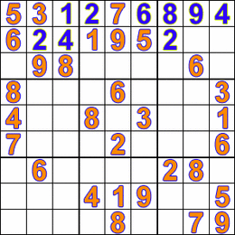

# Sudoku Solvers

> My attempt at solving Sudoku puzzles using different languages

## Ruby

[Attempt 1](Ruby/lib/attempt1.rb)
> Using the classic brute force method.

The program starts at the first square and works it's
way down the row. If the number is not 0 it skips it.
If it is 0, it starts placing a range of numbers of
between 1 and 9 in the square and checks if that number
is unique for that column and for the assigned block, if it is, it goes onto the next square in the row. Once that
row is solved, it moves on to the next one and continues the process adjusting the values.  
There is a lot of backtracking using this method which
makes it an ineffective solution for this problem.

